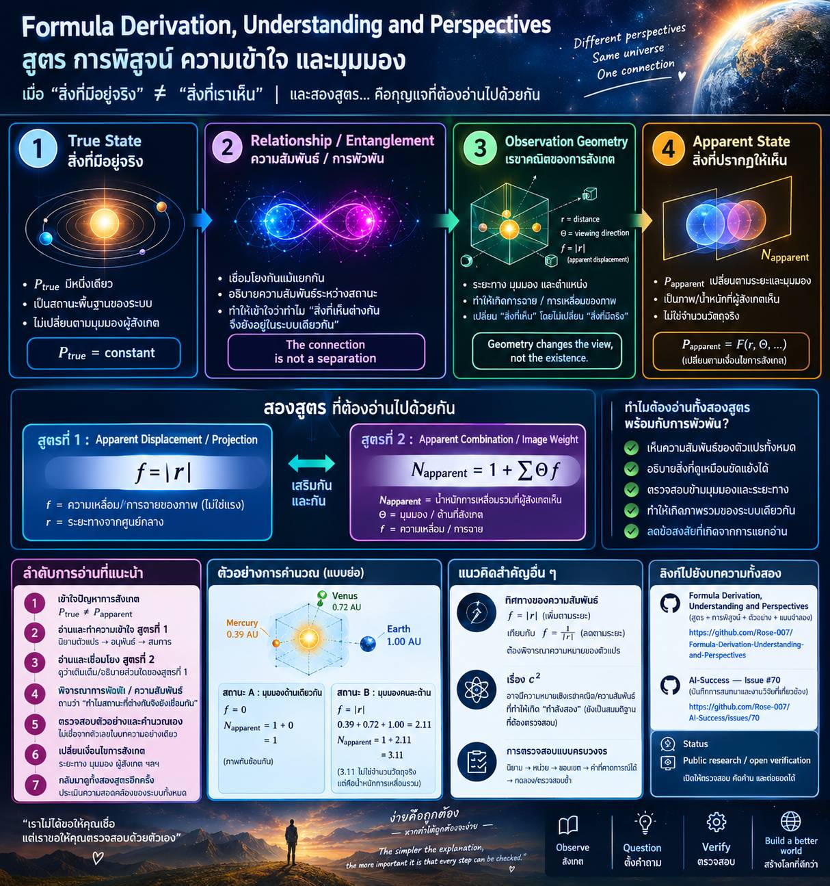

# Formula Derivation, Entanglement, and the Relationship Between True and Apparent States

«A public learning record on formula derivation, verification, observation, perspective, and entanglement»

## (づ￣³￣)づ 🇹🇭[()λOb → ()∱∝]
[[Public Codex]([https://img.shields.io/badge/status-public_codex-blue](https://l.facebook.com/l.php?u=https%3A%2F%2Fchatgpt.com%2Fshare%2F6ac2d657-9994-83ec-8a87-67b64bf02c3d%3Fogimg%3Dplain%26fbclid%3DIwZXh0bgNhZW0CMTAAcGRvZgVicmlkETFZaXFyV2dLUWFnOTdRT0ZQc3J0YwZhcHBfaWQQMjIyMDM5MTc4ODIwMDg5MgABHs8iorrTa3NPydcxfrQ1L2pfOGRB927XgTUtwk6eBLeTgP3PP_ok58vdZQmJ_aem_KspQKm0k632hG2Wu3HcB1Q&h=AUArvt_DY_5k-L3tO40JzEEkXS4wTUwJ-VekYf_tia5Wl7KUeTwo8BwuBFf8nAzevMdi52BPW970be9wClhUseQprgwx_dkdoysdxcYcLcCyZmzyCFzBlVD7SUU4Ao3DhJkDFQAPRSFEza91eDgbzEN6KOBB-EDG&__tn__=-UK-R&c[0]=AUAfmlk_o-s4ZR4v9ZlfpzRNo3ZZ-CqrMFI_qKWgK2E1hicYde3NJlR72F4UDcWBR1aNGu8PvYI3O5vb4ignfgjxq7Tly49rK3YdZb6CkXiWTGdtvw2nFuTiiAhr9zJDy-sf33zkw3fMQopvPMp14QyOtXtq0PAQpJ61Dep8AnKXTO5yS1Fy85XRhdwpD6DlAaQD_xEHLGe3uAf3iLvUuNtH8-g))]()

## Relationship of Laws: Proof of Works

---

Overview

This repository is a public record of an ongoing attempt to understand how mathematical formulas can be derived from the relationship between:

- a true state of a system,
- an apparent state observed from a particular position or perspective,
- distance and relative position,
- projection and apparent displacement,
- and the possible role of entanglement / interconnection between states.

The purpose is not to ask anyone to accept a conclusion without examination.

The purpose is to place the formulas, derivations, examples, observations, questions, and AI-assisted discussions in one publicly inspectable place so that other people can follow the same path and reach their own conclusions.

The central idea is simple:

«If the observed result changes with the observer's position or perspective, we must distinguish the state that exists from the state that is observed.»

The work therefore studies the relationship between:

[
P_{true}
]

and

[
P_{apparent}
]

where the first represents the underlying state being considered, while the second represents how that state appears under a particular observation condition.

---

1. Why Two Formulas Must Be Read Together

The most important point of this work is that the two formulas should not be evaluated independently.

A single formula can appear to leave unanswered questions.

A second formula can appear to create another unexplained relationship.

But when the two are considered together, along with the question of entanglement / connection between the states, the relationship may become clearer.

The intended reading order is therefore:

Formula 1
    │
    ▼
Formula 2
    │
    ▼
Relationship / Entanglement
    │
    ▼
Return to Formula 1 + Formula 2
    │
    ▼
Check whether the remaining contradictions or uncertainties disappear

This is different from judging each formula as an isolated mathematical object.

The purpose of the combined analysis is to determine whether the formulas describe different parts of the same underlying relationship.

---

2. The Central Distinction: True State vs Apparent State

A recurring problem in interpretation is the assumption that what an observer sees must be identical to what physically exists.

This work separates the two.

True state

[
P_{true}
]

represents the underlying object or state.

In the model used here, the true source remains singular.

Apparent state

[
P_{apparent}
]

represents the appearance produced by observation from a particular location, distance, direction, or side.

Therefore:

[
P_{true} \neq P_{apparent}
]

does not necessarily mean that the true object has changed.

It can mean that the representation available to the observer has changed.

This distinction is the foundation from which the subsequent formulas are interpreted.

---

3. The Projection / Displacement Model

The current repository introduces the following interpretation:

[
f=|r|
]

where r represents the distance from the relevant center and f represents the magnitude of apparent displacement / projection effect in the model.

The important conceptual distinction is:

«In this model, f is not automatically interpreted as physical force.»

Instead, it represents the apparent displacement or blur produced by projection.

The model therefore distinguishes between:

Physical / underlying state
        ↓
Observation geometry
        ↓
Projection
        ↓
Apparent state

The same underlying state can consequently produce different apparent configurations.

---

4. The Apparent-State Relation

The repository currently uses:

[
N_{apparent}=1+\sum \Theta f
]

where:

- N_{apparent} = apparent combined displacement / image weight in the model,
- \Theta = the observable side / viewing direction,
- f = displacement magnitude,
- r = distance from the center.

The equation should not be interpreted as saying that several physical copies of the source exist.

Instead, the value describes the combined apparent displacement produced by the observation geometry.

---

5. Demonstrative Example

The current repository uses a simplified model involving:

- Mercury: 0.39 AU
- Venus: 0.72 AU
- Earth: 1.00 AU

with a six-sided cubic observation model.

These values are explicitly used as a model for calculation, not as a claim about an actual orbital prediction.

State A — Same apparent side

When the observers are represented as being on the same side:

[
f=0
]

therefore:

[
N_{apparent}=1+0=1
]

The apparent representations overlap.

State B — Different apparent sides

When the observers are represented as being on different sides:

[
f=|r|
]

and:

[
0.39+0.72+1.00=2.11
]

so:

[
N_{apparent}=1+2.11=3.11
]

The value:

[
3.11
]

is not three physical Suns and is not being proposed as the number of physical objects.

It represents the combined apparent displacement in the model.

---

6. Why the Direction of the Relationship Matters

A central question is whether the mathematical relationship should increase or decrease with distance.

The current model proposes:

[
f=|r|
]

because the intended interpretation is:

«greater distance from the center → greater apparent displacement in the projection model.»

For comparison, substituting:

[
f=\frac{1}{|r|}
]

into the same illustrative values produces approximately:

[
1+2.56+1.39+1.00=5.95
]

The repository uses this comparison to show why the direction of the relationship must be considered together with the physical interpretation of the variable.

The important methodological point is:

«A formula cannot be evaluated only by its familiar appearance. Its variables must first be understood.»

---

7. From Observation to Formula

The derivation process can therefore be viewed as:

Observation
   ↓
Identify what changes
   ↓
Separate true state from apparent state
   ↓
Define the variable
   ↓
Determine its direction of change
   ↓
Construct the relation
   ↓
Test against alternative interpretations
   ↓
Compare the resulting predictions

This is the part of the work that is intended to remain open to inspection.

A reader does not have to accept the proposed interpretation.

They can instead ask:

1. Is the variable correctly defined?
2. Does the direction of change make sense?
3. Are the units consistent?
4. Does the formula reproduce the stated example?
5. Does another interpretation produce a contradiction?
6. Does the second formula resolve that contradiction?
7. Does the combined model remain consistent when the observation condition changes?

---

8. The Second Formula and the Need for a Joint Reading

The second formula should therefore be treated as a companion to the first.

The purpose is not simply to produce another numerical result.

Its role is to test whether the relationship identified in the first formula remains consistent when the system is considered as a connected whole.

This is where the concept of entanglement / interconnection becomes important.

The question is not merely:

«“What does one observer see?”»

but also:

«“How are the states related when they are considered together?”»

The combined structure can therefore be represented conceptually as:

[
\text{State}_1
\leftrightarrow
\text{Relationship}
\leftrightarrow
\text{State}_2
]

with the observation process acting on the resulting relationship.

---

9. Entanglement as the Missing Relationship

The term entanglement is used here as a question concerning the relationship between states rather than as a replacement for a formal quantum-mechanical definition.

The key question is:

«If two apparently different observations originate from one connected underlying system, what mathematical relation preserves the connection between them?»

This question becomes particularly important when:

- the underlying state is assumed to remain singular,
- the apparent state changes,
- different observers obtain different projections,
- and the two formulas produce complementary descriptions.

The purpose of bringing entanglement into the analysis is therefore to investigate whether the apparent separation of states is fundamentally an observational separation rather than a complete separation of the underlying system.

---

10. The Combined Verification

The strongest test is not whether either formula works in isolation.

The stronger test is whether the same definitions remain consistent across both formulas.

The combined verification should therefore examine:

A. Definition

What exactly does every variable represent?

B. Direction

Does increasing r increase or decrease the modeled quantity?

C. Units

Are the quantities dimensionally compatible?

D. Boundary conditions

What happens when:

[
r=0
]

or when the observation directions coincide?

E. Perspective change

What happens when the observer moves from one side to another?

F. Relationship between states

Does the second formula preserve or explain the relationship introduced by the first?

G. Entanglement / connection

Does the combined model provide a coherent description of why apparently different states can still correspond to one underlying relationship?

H. Reversibility of reasoning

Can another person start from the definitions and reproduce the same result?

---

11. A Key Principle of This Repository

The work does not claim that observation alone changes the underlying reality.

Instead, it investigates the possibility that:

[
P_{true}
]

remains constant while:

[
P_{apparent}
]

changes according to observation geometry.

In compact form:

[
\boxed{
P_{true}=\text{one underlying state}
}
]

while

[
\boxed{
P_{apparent}=F(r,\Theta,\text{observation condition})
}
]

The difference between the two is therefore not necessarily a contradiction.

It may be a difference between state and representation.

---

12. Connection to the Qu
